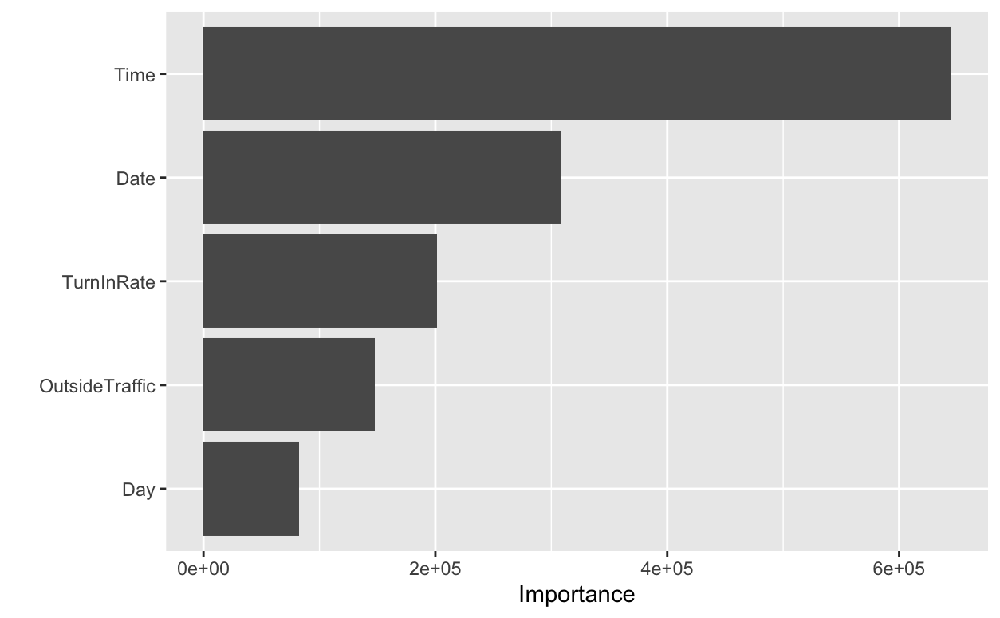
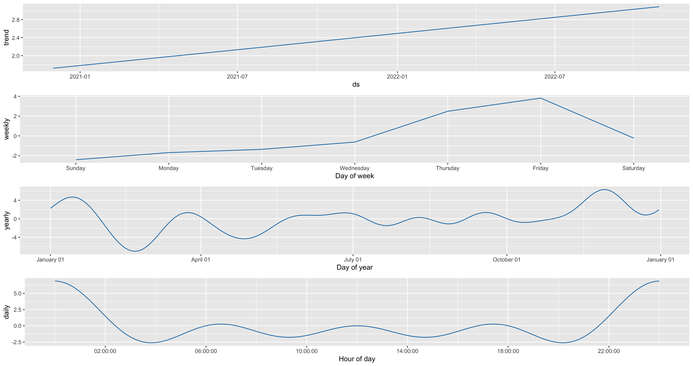
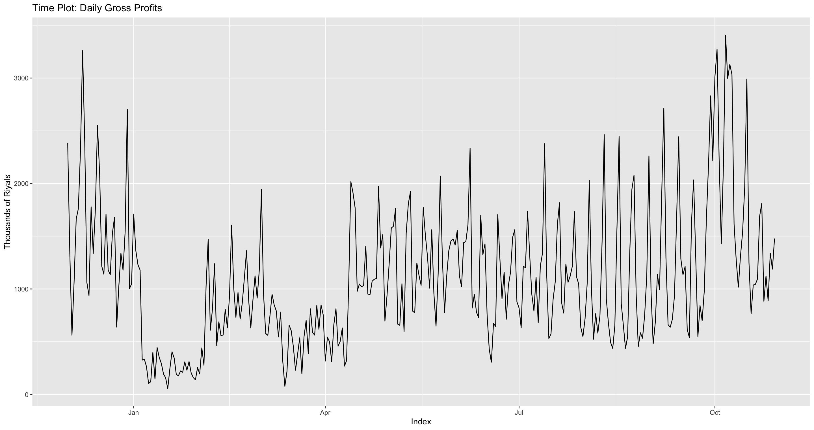
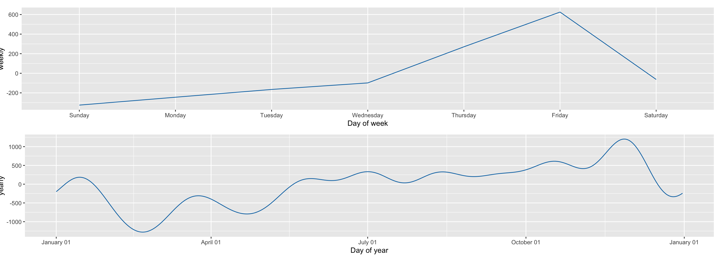

```{r setup, include=FALSE}
knitr::opts_chunk$set(echo = FALSE)
```

<style type="text/css">
body p {
  color: #000000;
}
</style>

## Introduction {data-background=#FAF0E6}


Increasing the sales and profit margins is one of the most crucial priority of business owners. Thus, an owner of a local cafe asked me do some analysis on three different data to increase the number of customers which will increase profits.

```{r, echo=FALSE, out.width="40%"}

```

## Research questions {data-background=#FAF0E6}

How could a cafe increases it's profits?

To answer this question or to discover new information, or confirm an idea they already know, I plan to:

- Discover what are the days that have many customers using time series on visitors data.
- Discover what are the best seller items using the products data.
- Looking for trends to figure out what are the hours, days, and months that have many costumers.


## The source and structure of the data {data-background=#FFFFFF}

The visit data is from a device the owner of the Cafe put above the main door to count the visitors and have some extra variables.It has 6 variables and 8089 observations.

| Variable             | Description                              |
|----------------------|------------------------------------------|
|day                   | The date                                 |
|Time                  | The hour of the date                     |
|ValueIn               | The number of visitors                   |
|ValueOut              | The number of visitors leaving the cafe  |
|Turn In Rate(%)       | The rate of visitors turn in             |
|OutsideTraffic        | The number of people outside the cafe    |


## Items Data {data-background=#FFFFFF}

The items data from the sales website and it has 5 variables and 96 observations. 

| Variable             | Description                              |
|----------------------|------------------------------------------|
|item                  | The name of the item                     |
|count                 | How many pieces have been sold           |
|price                 | The overall price                        |
|cost                  | The cost of the items                    |
|profits               | The amount of money earned               |


## Sales Data {data-background=#FFFFFF}
- The sales data is from the sales website that he is using directly and has the 5 variables and 338 observations.

| Variable             | Description                              |
|----------------------|------------------------------------------|
|Total sales           | The total number of sales                |
|Items cost            | The cost of the sold items               |
|Taxes                 | Additional fee                           |
|Offers                | Discount or some offers                  |
|Profits               | The amount of money earned               |


## Assumptions {data-background=#FAF0E6}

1. In visit data, the variables are positively skewed due to the large number of zeros and ones since it is hourly data.

2. It is not enough data since the cafe is open for less that a year.

```{r, echo=FALSE, out.width="40%"}

```


## EDA {data-background=#FAF0E6}

- After uploading the data and exploring the distributions of the variables, I decided to remove the variable Value out since it doesn't add any value to the number of visitors.
```{r,include = FALSE}
## load packages
library(tidyverse)
library(kknn)
library(ggrepel)
library(corrplot)
library(dplyr)       # for data manipulation
library(EnvStats)
library(RColorBrewer)
library(vip)         # for variable importance
#Time Series
library(tseries)
library(forecast)
library(xts)
library(fpp3)
library(tsibble)
# Ploting
library(reshape2)
library(plotly)
library(ggplot2)
library(ggpubr)  #To arrange plots on one page

# Modeling process
library(tidymodels)

#Downloading the data

visit.dat <- read.csv("~/Documents/GitHub/DS_Capstone_Cafe_Analysis/Hourlydata.csv")

```


```{r}
VI.plot <- ggplot(data=visit.dat, aes(x=ValueIn)) +
        geom_histogram(fill="black",bins = 30) +
        xlab("The number of visitors") +
        NULL

OT.plot <- ggplot(data=visit.dat, aes(x=OutsideTraffic)) +
        geom_histogram(fill="black",bins = 30) +
        xlab(" The number of people outside the cafe ") +
        NULL

TI.plot <- ggplot(data=visit.dat, aes(x=TurnInRate)) +
        geom_histogram(fill="black",bins = 30) +
        xlab("The rate of visitors turn in") +
        NULL

ggarrange(VI.plot, OT.plot, TI.plot + rremove("x.text"),
          ncol = 2, nrow = 2)

```

-A large number of zeros is because of the hourly data.


## Important features using Decision Trees {data-background=#FAF0E6}

```{r, echo=FALSE}

```

- The time, and Date are the most important variables.


## Effect of hours on visitors count {data-background=#FAF0E6}

```{r echo=FALSE, cache=FALSE, results=TRUE, warning=FALSE, comment=FALSE, warning=FALSE}

Time_vig <- plot_ly(visit.dat, y =  visit.dat$ValueIn, type = 'bar', color = ~Time) %>%
  layout( barmode = 'stack')
Time_vig
```

- We can see that there are many customers at night from 7pm until 12pm, but the highest number of visitors were at 22pm and 23pm.


## The effect of the day on visitors count {data-background=#FAF0E6}
```{r, echo=FALSE, cache=FALSE}

ggplot(visit.dat, aes(fill = factor(Day), max(ValueIn))) +
  geom_bar(position = "dodge") +
  NULL
```

- weekends have the highest number of visitors.


## Discovering what are the best seller item using the products data {data-background=#FAF0E6}

```{r echo=FALSE, cache=FALSE, results=TRUE, warning=FALSE, comment=FALSE, warning=FALSE}
#Downloading the data
Items <- read.csv("~/Documents/GitHub/DS_Capstone_Cafe_Analysis/Items.csv")

```

```{r, echo=FALSE, cache=FALSE}
Items$item[Items$profits== max(Items$profits) & Items$count== max(Items$count)]
Items$profits[Items$item== "Flat white"]
```
Flat White is the best seller and most profitable item!
```{r, echo=FALSE, out.width="28%"}

```

## Items with more than 2000 Pieces sold in 11 months {data-background=#FAF0E6}
```{r, echo=FALSE, cache=FALSE}
Items$item[Items$count > 2000]
```
The best selling items are drinks. Looks like we drink hot drinks even in the very hot weather since most of them are hot drinks. (At least water is on the list)

# Which Items are not profitable? {data-background=#F8F8FF}
```{r, echo=FALSE, cache=FALSE}
#Choosing the items where the profits and counts are less than the average. 
Items$item[Items$profits == min(Items$profits)]
```

 Maybe it is a good idea to think about replacing or removing this drink.

## Trend {data-background=#FAF0E6}

```{r, echo=FALSE, out.width="95%"}

```

## Sales Data {data-background=#FAF0E6}

```{r echo=FALSE, cache=FALSE, results=TRUE, warning=FALSE, comment=FALSE, warning=FALSE}
#Downloading the data
sales.data <- read.csv("~/Documents/GitHub/DS_Capstone_Cafe_Analysis/sales-data.csv")

```


```{r}
# Ploting the response
Prof.plot <- ggplot(data=sales.data, aes(x=Profits)) +
        geom_histogram(fill="black",bins = 30) +
        xlab("The amount of money earned") +
        NULL

## The rest of the variables
cost.plot <- ggplot(data=sales.data, aes(x=Items.cost)) +
        geom_histogram(fill="black",bins = 30) +
        xlab("The cost of the sold items") +
        NULL


tax.plot <- ggplot(data=sales.data, aes(x=Taxes)) +
        geom_histogram(fill="black",bins = 30) +
        xlab("Additional fee") +
        NULL


offer.plot <- ggplot(data=sales.data, aes(x=Offers)) +
        geom_histogram(fill="black",bins = 30) +
        xlab("Discount or some offers") +
        NULL


tot.sale.plot <- ggplot(data=sales.data, aes(x= Total.sales)) +
        geom_histogram(fill="black",bins = 30) +
        xlab("The total number of sales") +
        NULL

ggarrange(Prof.plot, cost.plot, tax.plot, offer.plot, tot.sale.plot + rremove("x.text"),
          ncol = 3, nrow = 2)

```

- All the variables are positively skewed. A large number of zeros duo to the closing hours. 


## Trend {data-background=#FAF0E6}

- Repeating pattern over time.

```{r, echo=FALSE, out.width="70%"}

```


## Daily Trend {data-background=#FAF0E6}

```{r, echo=FALSE, out.width="90%"}

```

## Seasonality {data-background=#FAF0E6}

- It is a repeating pattern within a year. We can not see that in our data because we don't have a record for a whole year.

There is no Seasonality in my data.


## Challenges {data-background="how-to-overcome-blogging-challenges.png}

- Doing a time series model for a short time is not easy specially with some challenges such as covid-19 lockdown.
- In the time series, there is not enough data for a whole year, which prevent me from looking to the seasonality. I tried different ways to check it but nothing works.


## Conclusion {data-background=#FAF0E6}

To increase the number of visitors and thus profits, I suggest focusing on weekends and night hours as they tend to increase the number of people. Also, removing unprofitable products from then and increasing the number of profitable products may help.

```{r, echo=FALSE, out.width="30%"}

```


## Outlook for future development {data-background=#FAF0E6}
Deploying the model is one of what I plan to do in the future to feed it with the new data after completing one year from the opening date.


## Limitations & problems {data-background=#FAF0E6}

The problem that I faced is that as I said, there is no seasonality in the data. I think that due to covid-19 lockdown and the limited number of customers that are allowed to enter the cafe. The Limitation was in the data since it is for a period that is less than a year.

## References {data-background=#FAF0E6}

1. https://rpubs.com/JSHAH/481706
2. https://otexts.com/fpp3/


## Thank you for listining {data-background="QandA.jpeg"}


- Any question? 

```{r, echo=FALSE, out.width="15%"}

```


```{r, echo=FALSE, out.width="15%"}

```